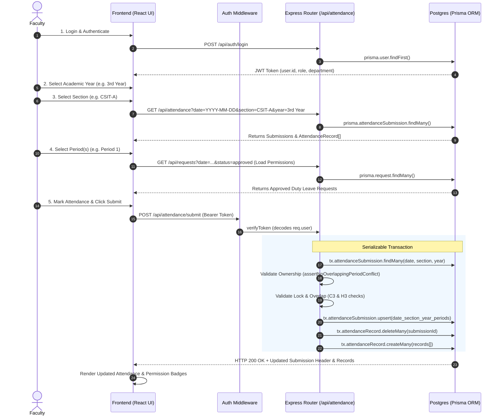

# AttendEase End-to-End Attendance Reference Architecture & Lifecycle Flow

## 1. Executive Summary

This document serves as the **Reference Architecture** for the AttendEase Attendance System. It details the complete 13-step lifecycle of attendance management: from authentication and selection to lock validation, transactional saving, public permission API fetching, and UI rendering.

---

## 2. Complete Attendance Lifecycle Trace



---

## 3. Detailed Step-by-Step Architecture Trace

### Step 1: Faculty Login
- **Description**: Faculty member authenticates via password, 4-digit PIN, or biometric Passkey.
- **Route**: `POST /api/auth/login` (or `POST /api/auth/passkey/login-verify`)
- **Controller/Handler**: `backend/src/routes/auth.ts`
- **Middleware**: None (Public Auth Route)
- **Prisma Query**:
  ```ts
  prisma.user.findFirst({
    where: {
      OR: [
        { email: { equals: identifier, mode: 'insensitive' } },
        { userId: { equals: identifier, mode: 'insensitive' } },
      ],
      isActive: true,
    },
  })
  ```
- **Database Tables**: `User`, `UserPasskey`
- **Output**: Returns signed JWT containing `{ id, userId, email, name, role: 'faculty', department }`.

---

### Step 2: Select Academic Year
- **Description**: User selects academic year (e.g. `1st Year`, `2nd Year`, `3rd Year`, `4th Year`).
- **Layer**: Client-side state transition in `frontend/src/pages/faculty_portal/Attendance.tsx` (`selectedYear`).
- **Middleware / Route / DB**: N/A (Frontend component state).

---

### Step 3: Select Section
- **Description**: User selects section (e.g. `CSIT-A`, `CSIT-B`, `CSD-A`).
- **Route**: `GET /api/attendance`
- **Controller/Handler**: `backend/src/routes/attendance.ts` -> `router.get('/')`
- **Middleware**: None (Publicly accessible for both Faculty portal & Public Permissions page)
- **Prisma Query**:
  ```ts
  prisma.attendanceSubmission.findMany({
    where: {
      date: targetDate,
      section: { equals: section.trim(), mode: 'insensitive' },
      year: { equals: year.trim(), mode: 'insensitive' },
    },
    include: {
      markedBy: { select: { userId: true, name: true, email: true, department: true } },
      records: true,
    },
    orderBy: { createdAt: 'asc' },
  })
  ```
- **Database Tables**: `AttendanceSubmission`, `AttendanceRecord`, `User`.

---

### Step 4: Select Period Block
- **Description**: Faculty selects period (e.g. `Period 1` or `Periods 1 & 2`).
- **Layer**: Client-side period selection in `Attendance.tsx` (`selectedPeriodIds`, `periodsKey`).
- **Client Matching**: Normalizes period key string (`"1,2"`) and searches fetched `submissions` array for exact matching `(date, section, year, periods)` submission header.

---

### Step 5: Load Student Roster
- **Description**: Loads active students for the selected department/section.
- **Route**: `GET /api/users`
- **Controller/Handler**: `backend/src/routes/users.ts` -> `router.get('/')`
- **Middleware**: `verifyToken` (`backend/src/middleware/auth.ts`)
- **Prisma Query**:
  ```ts
  prisma.user.findMany({
    where: { role: 'student', isActive: true, department: user.department },
    orderBy: { rollNumber: 'asc' },
  })
  ```
- **Database Tables**: `User`.

---

### Step 6: Load Approved Permissions
- **Description**: Fetches approved Duty Leave / Attendance Adjustment requests for today to pre-highlight permission students.
- **Route**: `GET /api/requests`
- **Controller/Handler**: `backend/src/routes/requests.ts` -> `router.get('/')`
- **Middleware**: `verifyToken`
- **Prisma Query**:
  ```ts
  prisma.request.findMany({
    where: { status: 'approved', date: targetDate },
    include: REQUEST_INCLUDE,
    orderBy: { submittedAt: 'desc' },
  })
  ```
- **Database Tables**: `Request`, `User`, `RequestFaculty`, `RequestAction`.

---

### Step 7: Mark Attendance
- **Description**: Faculty marks attendance (`present` / `absent`). Students with approved permissions default to `present` and are highlighted in yellow.
- **Layer**: Client-side state in `Attendance.tsx` (`markedAttendance`).

---

### Step 8: Validate Ownership
- **Description**: On POST submit, backend verifies whether an existing submission for the same `(date, section, year, periods)` is owned by `req.user.id` (`markedById`).
- **Service Validator**: `assertNoOverlappingPeriodConflict()` in `backend/src/routes/attendance.ts`
- **Rule**: Non-owners attempting to edit an existing submission without `HOD` or `Admin` role are rejected with `PeriodLockedError` (`403 Forbidden`).

---

### Step 9: Validate Lock & Period Overlap
- **Description**: Validates that incoming period numbers do not intersect any existing submission for the same date, section, and year under a different period key.
- **Service Validator**: `assertNoOverlappingPeriodConflict()`
- **Rule**: Overlapping period intersections under a different period key throw `PeriodOverlapError` (`409 Conflict`).

---

### Step 10: Save Attendance (Header Upsert)
- **Description**: Creates or updates `AttendanceSubmission` header inside a serializable Prisma transaction.
- **Route**: `POST /api/attendance/submit`
- **Controller/Handler**: `backend/src/routes/attendance.ts` -> `router.post('/submit')`
- **Middleware**: `verifyToken`
- **Prisma Query**:
  ```ts
  prisma.attendanceSubmission.upsert({
    where: {
      date_section_year_periods: {
        date: targetDate,
        section: normalizedSection,
        year: normalizedYear,
        periods: normalizedPeriods,
      },
    },
    update: { periodLabel, year: normalizedYear },
    create: {
      date: targetDate,
      section: normalizedSection,
      year: normalizedYear,
      periods: normalizedPeriods,
      periodLabel,
      markedById: user.id,
    },
  })
  ```
- **Database Tables**: `AttendanceSubmission`.

---

### Step 11: Update Attendance Records (Detail Bulk Insert)
- **Description**: Atomically clears old student records for the submission ID and bulk-inserts updated records.
- **Controller/Handler**: `attendance.ts` inside transaction
- **Prisma Queries**:
  1. `tx.attendanceRecord.deleteMany({ where: { submissionId: result.id } })`
  2. `tx.attendanceRecord.createMany({ data: records.map(...) })`
- **Database Tables**: `AttendanceRecord`.

---

### Step 12: Public Permission API Sync
- **Description**: Public `/permissions` verification page and Faculty portal fetch updated attendance submissions.
- **Route**: `GET /api/attendance`
- **Controller/Handler**: `backend/src/routes/attendance.ts` -> `router.get('/')`
- **Middleware**: None (Public)
- **Prisma Query**: `prisma.attendanceSubmission.findMany(...)`
- **Database Tables**: `AttendanceSubmission`, `AttendanceRecord`, `User`.

---

### Step 13: Frontend Rendering
- **Description**: UI maps `records` to student roll numbers, highlights permission-approved students with yellow indicators, and displays exact faculty approver name (`markedBy.name`).

---

## 4. Architectural Summary Matrix

| Step | Operation | Route | Handler File | Prisma Model(s) Involved | Key Guard / Constraint |
|---|---|---|---|---|---|
| 1 | Faculty Login | `POST /api/auth/login` | `auth.ts` | `User`, `UserPasskey` | Password / Passkey validation |
| 2 | Select Year | Client State | `Attendance.tsx` | N/A | `selectedYear` state |
| 3 | Fetch Submissions | `GET /api/attendance` | `attendance.ts` | `AttendanceSubmission`, `AttendanceRecord` | Query by `date`, `section`, `year` |
| 4 | Select Period | Client State | `Attendance.tsx` | N/A | `normalizePeriodsStr()` matching |
| 5 | Load Students | `GET /api/users` | `users.ts` | `User` | `role = 'student'` |
| 6 | Load Permissions | `GET /api/requests` | `requests.ts` | `Request`, `User` | `status = 'approved'` |
| 7 | Mark Attendance | Client State | `Attendance.tsx` | N/A | Yellow badge pre-marking |
| 8 | Validate Ownership | Middleware Validation | `attendance.ts` | `AttendanceSubmission` | `markedById == user.id` OR HOD/Admin |
| 9 | Validate Overlap | Middleware Validation | `attendance.ts` | `AttendanceSubmission` | `assertNoOverlappingPeriodConflict` |
| 10 | Upsert Header | `POST /api/attendance/submit` | `attendance.ts` | `AttendanceSubmission` | `@@unique([date, section, year, periods])` |
| 11 | Upsert Details | `POST /api/attendance/submit` | `attendance.ts` | `AttendanceRecord` | `deleteMany` + `createMany` |
| 12 | Public Fetch | `GET /api/attendance` | `attendance.ts` | `AttendanceSubmission` | Public access |
| 13 | UI Render | Client State | `Attendance.tsx` | N/A | Render records & approver name |
